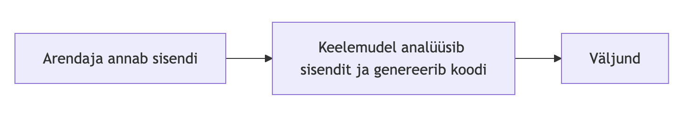

# Igaüks võib luua töötava veebilehe

## Kas sellest piisab, et olla arendaja?

Martti Raavel

<martti.raavel@tlu.ee>

---

## Miks mina täna siin olen?

- TLÜ Haapsalu kolledži rakendusinformaatika õppekava juht
- Õpetame veebiarendust
- Arengud tarkvaraarenduses ja väljakutsed sellega seoses

---

## Millest juttu tuleb?

- Mis on generatiivne TI?
- Kuidas kasutatakse generatiivset TI-d tarkvaraarenduses?
- Kas tulevikus (või juba praegu) on programmeerimise oskused üldse vajalikud?

---

## Mis on generatiivne TI?

---

## Mis on generatiivne TI?

Generatiivne TI, üks tehisintellekti rakendustest, võimaldab luua uut sisu, sh teksti, pilte ja heli. Seda tüüpi tehnoloogiat treenitakse olemasolevate näidete peal, näiteks tekstiandmed nagu raamatud ja veebilehed- masina õppimisprotsessi järel saabki TI abil luua sarnast sisu.

Allikas: <https://www.tlu.ee/tehisintellekt>

---

## Kui paljud teist kasutavad TI-d?

---

## Mille jaoks te TI-d kasutate?

---

## Kuidas TI-d kasutatakse tarkvaraarenduses?

Generatiivne TI on muutnud tarkvaraarendust mitmel viisil:

- Koodi testimine
- Koodi dokumenteerimine
- **Koodi genereerimine**
- Koodi täiustamine
- ...

---

## Kuidas see välja näeb?



---

## Proovime järele

---

## Prompt

`Palun loo lihtne veebipõhine rakendus ostunimekirja haldamiseks.`

---

## Kas tänapäeval nii käibki?

---

## Kas tänapäeval nii käibki?

GitHubi andmetel kasutab üle 90% USA arendajatest mingil moel AI koodiassistente oma töös või vabal ajal​

---

## Plussid

- Lihtsus ja mugavus
- Kiirus, suurem tootlikkus
- Vigade leidmine (kirjavead, erinevad nimetused muutjates jne)
- Algajatele sobiv, aga ...
- ...

---

## Miinused

- Piiratud loovus (põhineb treeningandmetel)
- Keeruliste projektide puhul ei pruugi nii hästi töötada
- Ajakohasus (põhineb treeningandmetel)
- Turvalisus
- Sõltuvus ja oskuste kahanemine
- ...

---

## Mida näitavad uuringud TI kasutamise kohta tarkvaraarenduses?

- Suurem tootlikus (korduvad ja 'tüütud' ülesanded jne)
- Vigade leidmine (kirjavead, erinevad nimetused muutjates jne)
- TI kirjutatud koodis on vähem vigu ihtsates ülesannetes
- TI kirjutatud koodis on rohkem vigu keerulistes ülesannetes
- TI kirjutatud kood on sageli pikem, kui inimese poolt kirjutatud kood (kordused, ebavajalikud osad)
- TI sobib rohkem tüüpiliste lahenduste loomiseks
- ...

---

## Kui soovid olla tarkvaraarendaja, siis kas on veel vaja osata programmeerida?

---

## Turvalisus - CSS süstimine

CSS süstimine on rünnak, mille käigus ründaja lisab pahatahtlikku CSS-i veebilehe koodile, et muuta selle välimust või käitumist.

See võib hõlmata näiteks veebilehe taustavärvi muutmist, elementide peitmist või isegi pahavara levitamist.

---

## Turvalisus - CSS süstimine - näide

```html
"Take out the trash
<style>
  body {
    background-color: red !important;
  }</style
>"
```

---

## Turvalisus - XSS (Cross Site Scripting)

XSS (Cross-Site Scripting) on turvaviga, mis võimaldab ründajal sisestada pahatahtlikku JavaScripti koodi veebilehele, mis seejärel käivitatakse teiste kasutajate brauserites.

---

## Turvalisus - XSS - näide

```html

```

---

## Turvalisus - HTML süstimine

HTML süstimine on rünnak, mille käigus ründaja lisab pahatahtlikku HTML-i veebilehe koodile, et muuta selle välimust või käitumist.

---

## Turvalisus - HTML süstimine - 1

```html
<a href="https://pahatahtlik.leht/phishing">Kõnni kolm kilomeetrit</a>
```

---

## HTML süstimine - 2

```html
Pick up groceries
<button onclick="window.open('https://www.example.com', '_blank')">
  Go to Example
</button>
```
