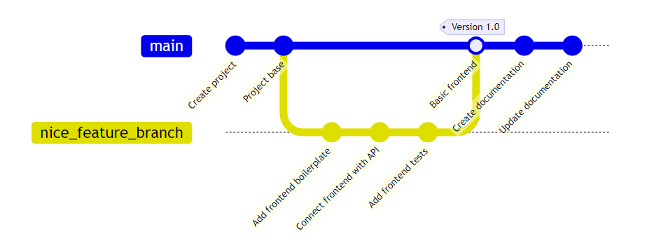
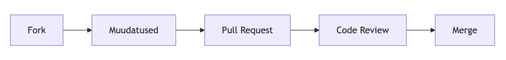

# Git ja GitHub Haapsalu kolledži õppetöös

Martti Raavel
<martti.raavel@tlu.ee>

---

## Teemad

- Mis on Git ja Github?
- Miks GitHub?
- Git - kontseptsioonid
- Tööriistad
- Pull Request ja Code Review protsess
- Github-i kasutamine Haapsalu kolledži õppetöös

---

## Mis on Git ja Github?

- Git on hajutatud versioonihaldussüsteem, mis on loodud Linus Torvaldsi poolt Linuxi tuumiku arendamiseks.
- Hajutatud tähendab, et iga kasutaja töötab oma kohaliku koopiaga 'originaalist' ja muudatused saab üles laadida serverisse.
- Github on veebipõhine platvorm, mis pakub Git-i haldamiseks lisateenuseid.

---

## Miks GitHub?

- Kasutajale tasuta
- Infrastruktuur
- Github Campus programm
  - Enterprise litsents
  - Github Student Developer Pack
- Sotsiaalne keskkond
- Integratsioonide võimalused
- Automatiseerimine (GitHub Actions)
- Suur turuosa
- Hetkel väga kiiresti arenev (AI + muud funktsionaalsused)
- ...

---

## Git - üldised kontseptsioonid - 1

- **Organisatsioon** - Üksus, mis haldab repositooriume ja kasutajaid
- **Repositoorium** (_repository_) - kataloog, mis sisaldab faile ja kaustu koos ajalooga
- **Fork** - repositooriumi koopia, mis on tehtud teise repositooriumi põhjal ja mis säilitab seose originaalrepositooiumiga
- **Kloon** - repositooriumi koopia, mis on tehtud serveris olevast repositooriumist

---

## Git - üldised kontseptsioonid - 2

- `clone` - repositooriumi kloonimine oma arvutisse
- `commit` - muudatuste salvestamine repositooriumisse
- `push` - saadab kohalikud muudatused serverisse
- `pull` - toob serverist uued muudatused ja ühendab need kohaliku versiooniga
- `fetch` - toob serverist uued muudatused, aga ei ühenda neid kohaliku versiooniga

---

## Git - Failide olekud

- `Untracked` – Git ei jälgi faili (pole `commit`-itud ega lisatud `staging area`-sse, nt uued failid).
- `Tracked` – Git jälgib faili (on `commit`-itud või lisatud `staging area`-sse).
- `Modified` – Muudetud fail, mida pole staging area-sse lisatud.
- `Staged` – Fail on lisatud staging area-sse (`git add`).
- `Committed` – Muudatused on salvestatud Git `repository`-sse `commit`-ina.
- `Ignored` – Fail, mida Git ignoreerib (`.gitignore` failis määratud).

---

## Git - Harud ja ajalugu - 1

---

## Git - Harud ja ajalugu - 2

- `Branch` – Haru, kus commit-e tehakse.
- `HEAD` – Viide viimasele commit-ile või harule, millel töötad.
- `main` / `master` – Peamine haru (sageli vaikimisi haru).
- `Pull Request` – Taotlus teha muudatused ühest harust teise.
- `Merge` – Harude ühendamine.
- `Code Review` – Koodi ülevaatus enne `merge`-imist.

---

## Eraldi tähendusega failid

- `.gitignore` - failid, mida ei soovita repositooriumisse lisada (nt `node_modules`, tundlikud andmed)
- `README.md` - vaikimisi kuvatav fail repositooriumi avalehel ja kaustades
- `LICENSE` - litsentsi fail, mis määrab, kuidas repositooriumi kasutada võib
- `CONTRIBUTING.md` - juhend projketi panustamiseks
- `Contributors.md` - nimekiri panustajatest
- ...

---

## Tööriistad

- **GitHub Desktop** - GitHubi ametlik rakendus graafilise kasutajaliidesega
- **VS Code** - Microsofti koodieditor
- **Markdown** - lihtne märgendikeel teksti vormindamiseks
- **mermaid.js** - diagrammide loomiseks Markdownis
- **Marp** - Markdowni põhine esitluste loomise tööriist
- **Käsurida** (`CLI`) - Git-i käskude kasutamiseks
- ...

---

## Pull Request ja Code Review protsess

- Uus haru
- Muudatused
- `git add`, `git commit`, `git push`
- `Pull Request`
- Määra `reviewer`
- `Code Review`
- Muudatuste nõudmine või `Merge`
- Haru kustutamine

---

## Github-i kasutamine Haapsalu kolledži õppetöös

- Õppematerjalide hoiustamine
- Panustamine õppematerjalidesse
- Koduse ülesannete andmine
- Koduste tööde esitamine
- Koduste tööde tagasisidestamine
- Portfoolio (kooli ja õpilase oma)
- Projektid/projektijuhtimine (GitHub Projects)
- Dokumentatsioon (rakendused, õppematerjalid, ...)
- Koolisiseste rakenduste arendamine
- ...

---

## Githubi struktuur kolledžis

- **Organisatsioon** - Haapsalu kolledži peamine organisatsioon
  - **Repositooriumid** - Õppematerjalid, arendatavad rakendused jms
    - **Harud** - Õppeaastad
- **Organisatsioon** - Õppekava
  - **Repositooriumid** - Grupitööd
  - **Projektid** - Projektid grupitööde jaoks
- **Organisatsioon** - Õpilase organisatsioon
  - **Repositooriumid** - Õppeainete repositooriumid
  - **Projektid** - Koduste tööde projekt

---

## Miks me hoiame õppematerjale Githubis?

- Harjutame õpilasi GitHubiga töötama
- Lihtne formaat (Markdown)
- Lihtne muuta
- Lihtne jagada
- Saame viidata eraldi õppematerjalide 'tükikestele' (struktuur)
- Ajalugu (iga aasta õppematerjalid on taastatavad)
- Koostöö (kõik saavad panustada) õppematerjalide arendamisse)
- ...

---

## Panustamine õppematerjalidesse

---

## Koduse töö esitamise protsess

- Õpetaja teeb `Issue` õpilasele vastavasse repositooriumisse
- Õpilane loob `Issue`-st haru koduse töö jaoks
- Õpilane kirjutab koodi/teksti
- `git add`, `git commit`, `git push`
- Õpilane teeb `Pull Request`-i `main` (`master`) harusse ja lisab õpetaja või teise õpilase `reviewer`-iks
- Õpetaja või teine õpilane teeb `Code Review`
- Vastavalt vajadusele nõutakse muudatusi või tehakse `Merge`
- `Issue` sulgub automaatselt

---

## VCS-i kasutamise plussid meie jaoks

- Kõik on ühes kohas
- Kõik on ajalooliselt jälgitav
  - Õppematerjalide versioonid
  - Õpilase panus
  - Analüütika
  - Läbipaistvus
  - ...
- Õpilastele kasulik oskus (tööturul nõutud)
- Mingil määral isedokumenteeriv
- ...

---

## Probleemid kasutamisega

- Alguses raske aru saada
  - Terminoloogia
  - Üldised põhimõtted
  - Konfliktid koodis
  - Käsurida
  - ...
- Mittearendajatele keeruline mõista?
- Õpetajate kaasamine
- ...

---

## Kuidas üritame probleemidest üle saada?

- Kasutamine alates esimesest päevast
  - Õppematerjalide jagamine
  - Ülesannete jagamine (Issued)
  - ...
- Tekstifailid (Markdown)
- Graafiline kasutajaliides (Github Desktop)
- Järk-järgult keerulisemaks (kood, harud, tõmbetaotlused, käsurida, ...)
- Tööriist õpetajatele koduste tööde haldamiseks (`Issue`-d, `Pull Request`-id)
- ...

---

## Muudatuste tagasivõtmine/ajaloos liikumine

- `git checkout` - liigub ajaloos tagasi spetsiifilise `commit`-i juurde
- `git reset` - muudab ajalugu, kustutades `commit`-e
- `git revert` - teeb uue `commit`-i, mis tühistab eelmis(t)e `commit`-i(de) muudatused
- `git reflog` - ajaloo logi
- `git switch` - liigub harude vahel (uus käsk)
