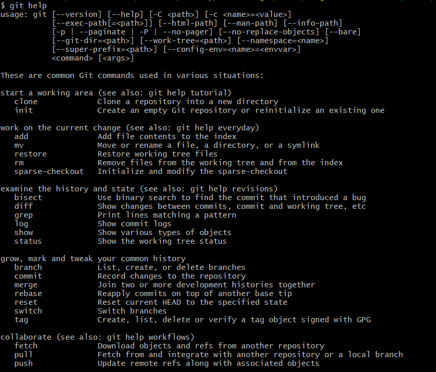
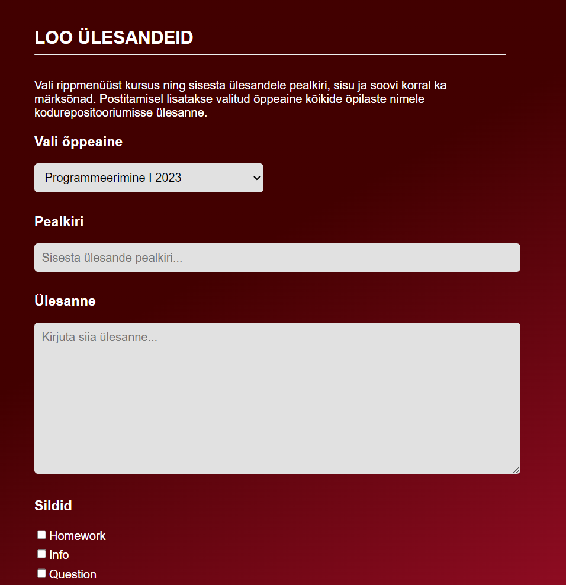

# Github versioonihalduskeskkonna kasutamise integreerimine õppetöösse

Martti Raavel
TLÜ HK RIF õppekava kuraator
<martti.raavel@tlu.ee>

---

## Tallinna Ülikooli Haapsalu kolledž

- Haapsalus
- 4 rakenduskõrghariduse õppekava
- 1 magistriõppekava
- Umbes 270 üliõpilast

---

## Rakendusinformaatika õppekava

- 25 aastat vana
- Algselt multimeediumile keskendunud
- Ajapikku fookus liikunud veebiarendusele
- Mitte ainult koodi kirjutamine
- Kõik, mis käib veebiarendusega kaasas

> Süstemaatilise versioonihalduse puudumine

---

## Mis on versioonihaldus?

Versioonihaldus on tarkvarakoodi muudatuste jälgimise süsteem.

`Allikas: Atlassian`

---

## Miks versioonihaldus?

Tarkvaraarenduses üks olulisemaid tööriistu

- Koodi ajalugu
- Koodi muudatuste jälgimine
- Koodi muudatuste tagasivõtmine
- Koodi muudatuste võrdlemine
- jne

> Ei pea olema ainult koodi jaoks!

`Pildi allikas: Double Momentum`

---

## Versioonihalduskeskkonnad

Keskkonnad, mis pakuavad versioonihaldusteenust:

- Github
- Gitlab
- Bitbucket
- ...

---

## Miks Github?

- Kasutajale tasuta
- Gihtub Campus programm
  - Enterprise litsents
  - Github Student Developer Pack
- Sotsiaalne keskkond
- Integratsioonide võimalused

---

## Probleemid kasutuselevõtuga

- Alguses raske aru saada
  - Terminoloogia
  - Üldised põhimõtted
  - Konfliktid koodis
  - Käsurida
  - ...
- Gruppide loomine tülikas
- Mittearendajatele keeruline
  

---

## Kuidas teha nii, et õppimine oleks sujuv?

- Kasutamine alates esimesest päevast
  - Õppematerjalide jagamine
  - Ülesannete jagamine (`Issued`)
- Tekstifailid (`Markdown`)
- Graafiline kasutajaliides (`Github Desktop`)
- Järk-järgult keerulisemaks (kood, harud, tõmbetaotlused, käsurida, ...)

---

## Milleks kasutame?

- Õppematerjalide repositoorium
- Kodused ülesanded/`Issue`'d
- Koduste tööde esitamine
- Portfoolio loomise võimalus
  - Koolile üldiselt
  - Õpilastele endale
- Projektid/projektijuhtimine (Github Projects)
- Dokumentatsioon (rakendused, õppematerjalid, ...)
- Suhtlus (mingil tasemel)

---

## Versioonihalduse plussid meie jaoks

- Kõik on ühes kohas
- Kõik on ajalooliselt jälgitav
  - Õppematerjalide versioonid
  - Õpilase panus
  - Analüütika
  - Läbipaistvus
  - ...
- Õpilastele kasulik oskus
- Õpilased saavad panustada materjalide arendamisse
- Mingil määral isedokumenteeriv
- ...

---

## Github-i probleemid meie jaoks

- Gruppide haldamine
  - Ainete kaupa (kohustuslik/valik)
- Individuaalsete ülesannete loomine gruppide kaupa
- Õpetajate kaasamine (palju majaväliseid õpetajaid)
- Ei sobi kõikide õppeainete jaoks

---

## Lahendused

- Kasutajate ja gruppide haldamise teenus
- Ülesannete loomise tööriist
- Õpetajate koolitus

---

## Mis edasi?

- Õppejõudude koolitus
- Kasutamata võimalused
  - Wiki
  - Github Pages
  - Github Actions
  - Analüütika
  - ...
- Uurida, kuidas teised kasutavad
- Jagada oma kogemusi

---

## Aitäh!

<martti.raavel@tlu.ee>
