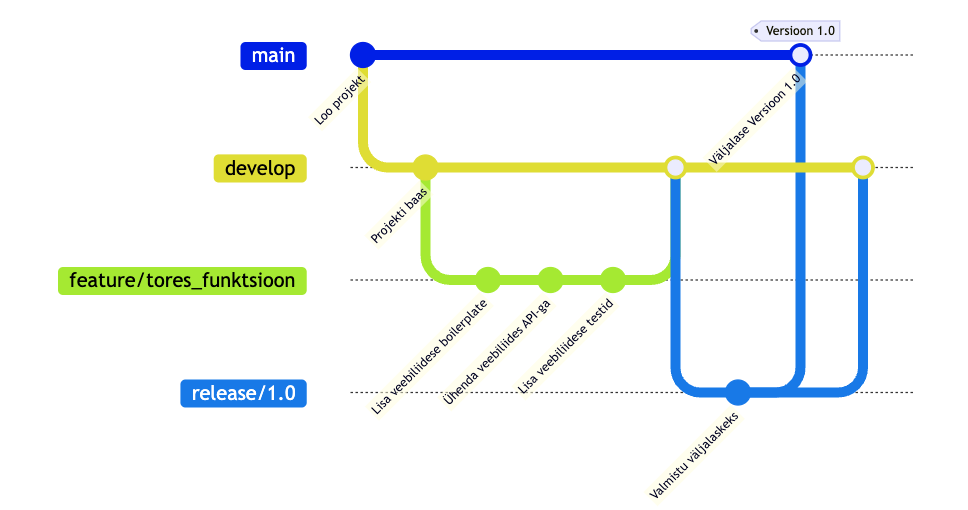
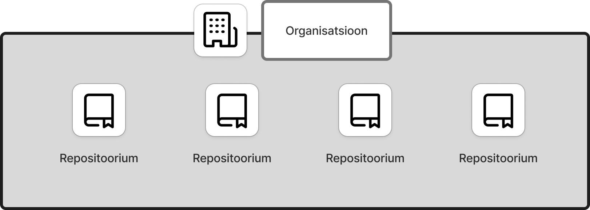
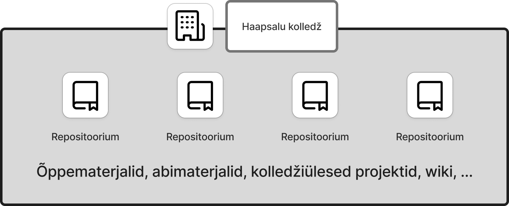
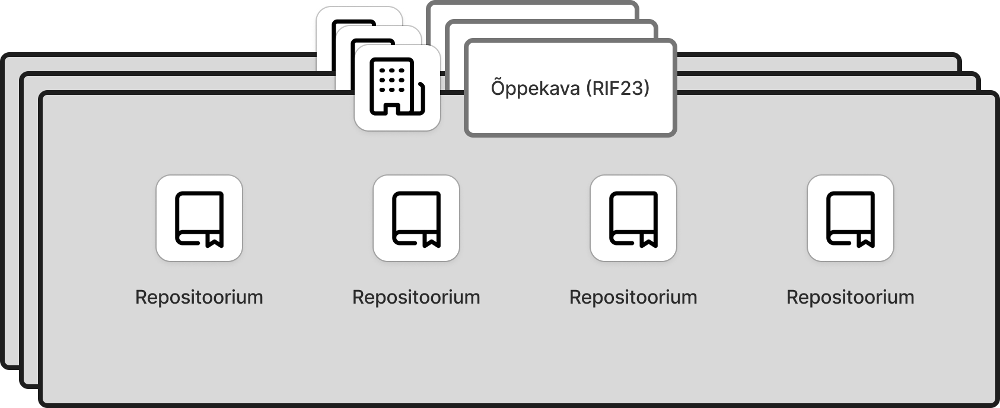
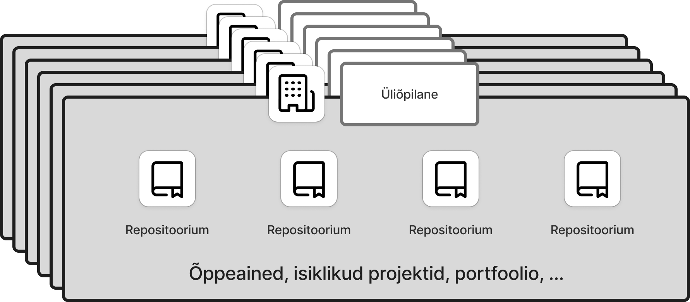

# Kuidas/miks õpetada versioonihaldust lõimituna

Martti Raavel
<martti.raavel@tlu.ee>

---

## Probleem

Kuidas integreerida versioonihaldust (Git) igapäevasesse õppetöösse ja muuta see õpilastele arusaadavaks?

---

## Miks peaks seda üldse tegema?

- Versioonihaldus on oluline oskus, mida nõutakse paljudes IT-valdkondades.
- Versioonihalduskeskkonnad võimaldavad koostööd ja koodi jagamist, mis on tänapäeva tarkvaraarenduses hädavajalik.
- Õpilased saavad praktilisi kogemusi, mis valmistavad neid ette tööturuks.

---

## Probleemid Git-i ja GitHubi kasutamisega

- Alguses raske aru saada
  - Terminoloogia
  - Üldised põhimõtted
  - Konfliktid koodis
  - Käsurida
  - ...
- Mittearendajatele keeruline mõista?
- Õpetajate kaasamine
- ...

---

## Kuidas üritame probleemidest üle saada?

- Järjekindel kasutamine alates esimesest päevast
  - Õppematerjalide jagamine
  - Ülesannete jagamine (Issued)
  - ...
- Tekstifailid (Markdown)
- Graafiline kasutajaliides (Github Desktop)
- Järk-järgult keerulisemaks (kood, harud, tõmbetaotlused, käsurida, ...)
- Tööriist õpetajatele koduste tööde haldamiseks (`Issue`-d, `Pull Request`-id)
- ...

---

## GitHubi struktuur

---

## GitHubi struktuur kolledžis - kolledži tasand

---

## GitHubi struktuur kolledžis - õppekava tasand

---

## GitHubi struktuur kolledžis - õpilase tasand

---

## Koodi ülevaatus

Koodi ülevaatus on protsess, kus arendajad vaatavad üle teise arendaja poolt kirjutatud koodi, et leida vigu, pakkuda tagasisidet ja teha ettepanekuid koodi parendamiseks.

See on tarkvaraarenduses oluline osa, mis aitab tagada koodi kvaliteeti ja vähendada vigu.

---

## Koodi ülevaatuse protsess

1. Koodibaasist tehakse uus haru
2. Kood kirjutatakse uues harus
3. Kood esitatakse ülevaatamiseks (Pull Request)
4. Ülevaataja vaatab koodi üle ja annab tagasisidet
5. Kui on vaja, tehakse muudatused ja esitatakse kood uuesti ülevaatamiseks
6. Kood kinnitatakse ja liidetakse põhiharusse (või mõnda teise harusse)

---

## Koduse töö esitamise protsess

- Õpetaja teeb `Issue` õpilasele vastavasse repositooriumisse
- Õpilane loob `Issue`-st haru koduse töö jaoks
- Õpilane kirjutab koodi/teksti
- `git add`, `git commit`, `git push`
- Õpilane teeb `Pull Request`-i `main` (`master`) harusse ja lisab õpetaja või teise õpilase `reviewer`-iks
- Õpetaja või teine õpilane teeb `Code Review`
- Vastavalt vajadusele nõutakse muudatusi või tehakse `Merge`
- `Issue` sulgub automaatselt

---

## Demonstratsioon

---

## GitHubi kasutamise plussid meie jaoks

- Kõik on ühes kohas
- Kõik on ajalooliselt jälgitav
  - Õppematerjalide versioonid
  - Õpilase panus
  - Analüütika
  - Läbipaistvus
  - ...
- Õpilastele kasulik oskus (tööturul nõutud)
- Mingil määral isedokumenteeriv
- ...

---
