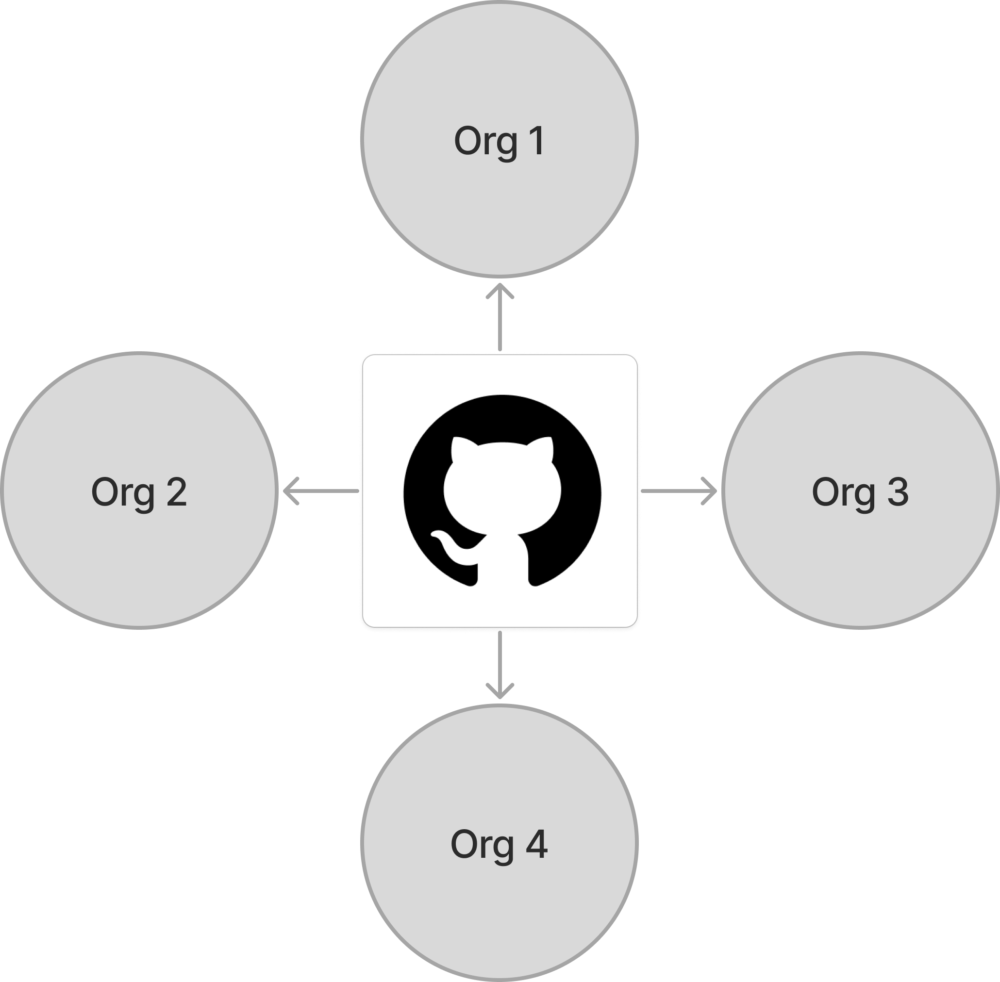
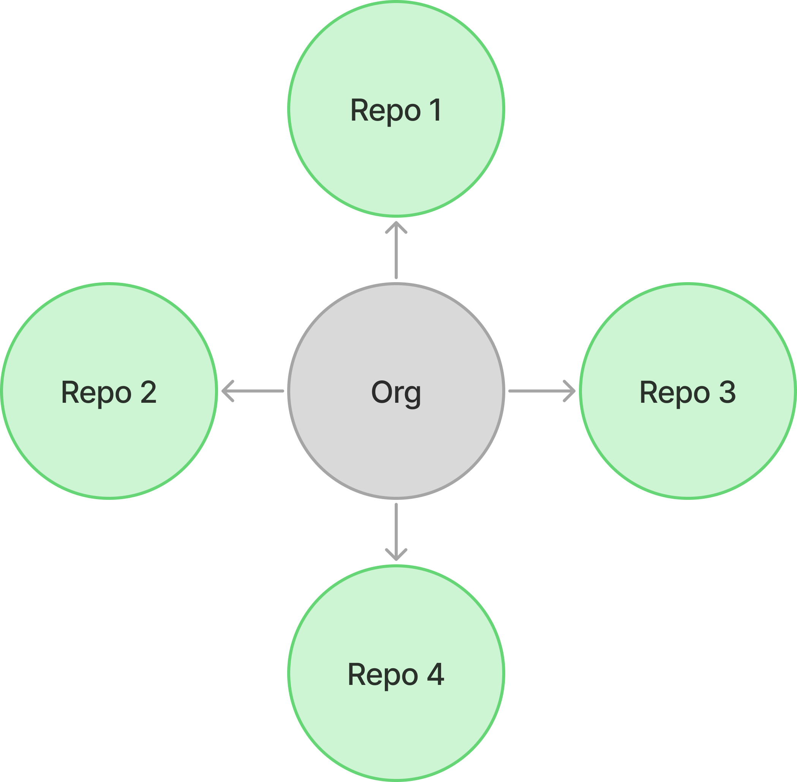
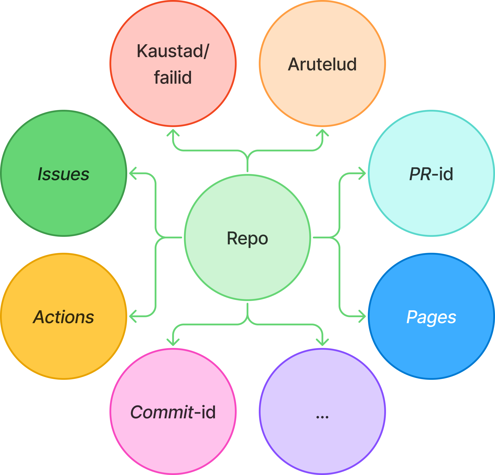

# GitHub koolis

## Informaatikaõpetajate suvekool 2026

Martti Raavel
<martti.raavel@tlu.ee>


---

## GitHub ei pea olema ainult arendajatele mõeldud keskkond!

---

## Miks õpetajale GitHub?

- õppematerjalide hoidmiseks/jagamiseks
- andmete ja failide jagamiseks
- muudatuste ajalugu
- koostöö kolleegide ja õppijatega
- tasuta avalik veebileht
- portfoolio ja projektide hoidla
- ...

---

## Git ja GitHub ühe lausega

> **Git** aitab failide muutusi jälgida (tööriist).
> **GitHub** on veebikeskkond, kus neid faile hoida, jagada ja avaldada (teenus).

---

## Lihtne võrdlus

| Git                              | GitHub                                              |
| -------------------------------- | --------------------------------------------------- |
| töötab arvutis                   | töötab veebis                                       |
| jälgib muudatusi                 | majutab repositooriume                              |
| võimaldab muudatusi tagasi võtta | näitab ajalugu                                      |
| toetab koostööd                  | lisafunktsionaalsus: arutelud, _issues_, veebilehed |
| ...                              | ...                                                 |

---

## GitHubi põhisõnavara

- **account**: kasutaja konto
- **organization**: ühine tööruum
- **repository**: projekti kaust GitHubis
- **commit**: salvestatud muudatus
- **README**: projekti avaleht
- **Pages**: veebilehe majutus

---

## GitHubi struktuur - organisatsioonid



---

## GitHubi struktuur - repositooriumid



---

## GitHubi struktuur - repositooriumid



---

## Mida repositoorium võib sisaldada?

- materjalid
- näited
- juhendid
- õppijate ülesanded
- veebilehe failid
- arutelud ja _issues_
- ...

> Git armastab tekstifaile ...

---

## Struktuur Haapsalu Kolledžis - kolledži tasand

- Kolledži organisatsioon
  - Õppematerjalid
  - Ülekoolilised projektid
  - Juhendid ja abimaterjalid
  - ...

---

## Struktuur Haapsalu Kolledžis - kursuste tasand

- Kursuste organisatsioonid
  - Koostööprojektid (praktikad)
  - ...

---

## Struktuur Haapsalu Kolledžis - õpilase tasand

- Õppijate organisatsioonid (igal õpilasel on oma organisatsioon)
  - Individuaalsed õppeainete repositooriumid
  - Individuaalprojektid
  - Katsetused ja prototüübid
  - ...

---

<style scoped>
table {
  width: 100%;
  font-size: 30px;
}

th, td {
  padding: 18px 28px;
}
</style>

## Milleks GitHubi koolis kasutada?

| Õpetajale          | Õppijale             |
| ------------------ | -------------------- |
| kursuse materjalid | portfoolio           |
| tunnikavad         | projektipäevik       |
| näidisprojektid    | rühmatöö             |
| klassi veebileht   | veebilehe avaldamine |
| ...                | ...                  |

---

## Kuidas GitHubi kasutada?

Täna teeme väikese veebilehe GitHub Pagesiga:

1. loome konto
2. loome repositooriumi
3. lisame `README.md`
4. teeme `index.md` faili
5. lülitame sisse GitHub Pagesi

---

## Mis on Markdown?

Markdown on lihtne märgendikeel, mida toetavad paljud veebikeskkonnad, sealhulgas GitHub.

- pealkirjad
- loendid
- lingid
- pildid
- koodinäited

---

## Markdowni põhisüntaks

```markdown
# Pealkiri

## Alapealkiri

- esimene punkt
- teine punkt

[Tallinna Ülikool](https://www.tlu.ee)

**oluline tekst**
```

---

## README.md

Repositooriumi esimene visiitkaart:

- mis projekt see on?
- kellele see mõeldud on?
- kuidas seda kasutada?
- kust alustada?

---

## Mis on Marp?

Marp teeb Markdownist slaidid.

- kirjutad lihtsas tekstis
- eraldad slaidid `---` reaga
- saad eksportida PDFiks või HTMLiks
- sobib õppematerjalideks ja töötoa slaidideks

---

## Marpi väike näide

```markdown
---
marp: true
---

# Minu esitlus

---

## Teine slaid

- üks mõte
- teine mõte
```

---

## Harjutus 1: GitHubi konto

Mine aadressile:

**github.com**

Tee konto või logi sisse.

---

## Harjutus 2: repositoorium

Loo uus repositoorium:

- nimi: `github-koolis`
- nähtavus: public
- lisa `README.md`

---

## Harjutus 3: avaleht

Lisa fail:

**index.md**

```markdown
# Minu esimene GitHubi leht

Tere tulemast!

- minu aine
- minu õppematerjal
- minu projekt
```

---

## Harjutus 4: GitHub Pages

Repositooriumis:

1. vali **Settings**
2. vali **Pages**
3. vali branch: **main**
4. vali folder: **root**
5. salvesta

---

## Aitäh!

Küsimused ja arutelu

**martti.raavel@tlu.ee**
