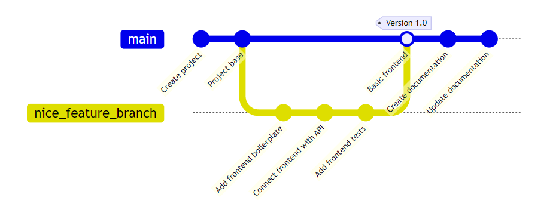
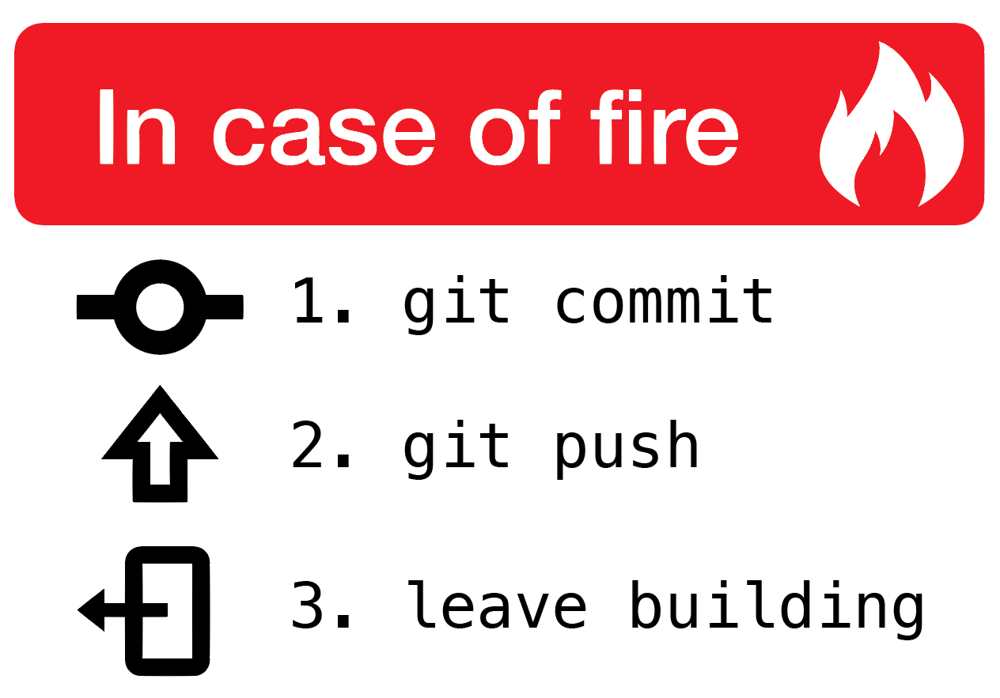
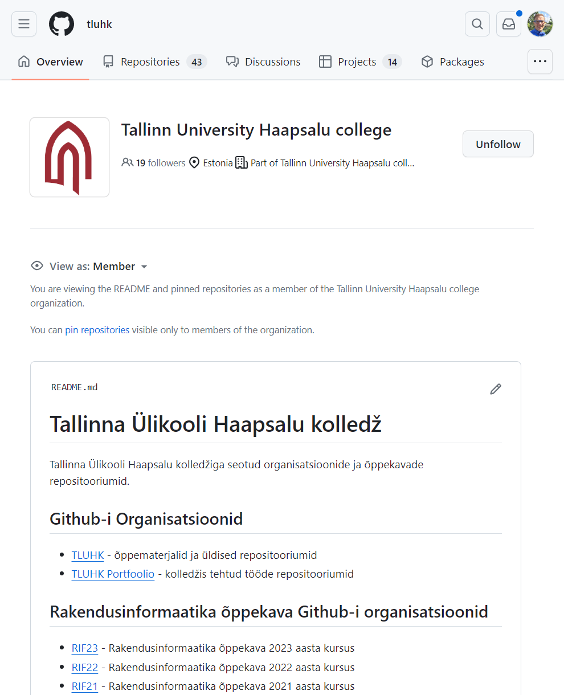
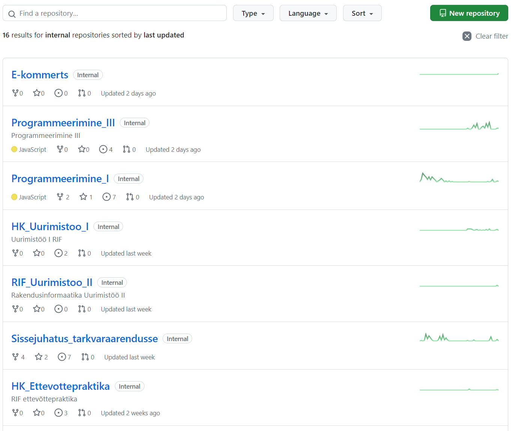
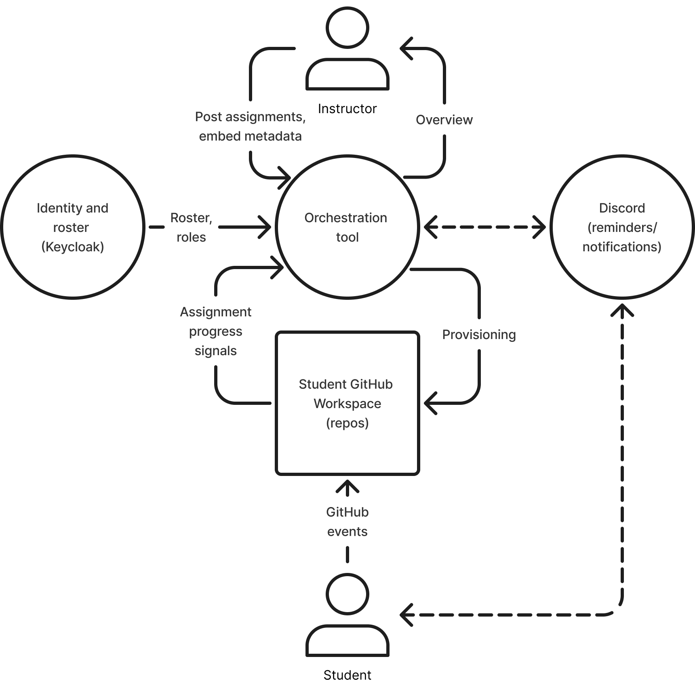
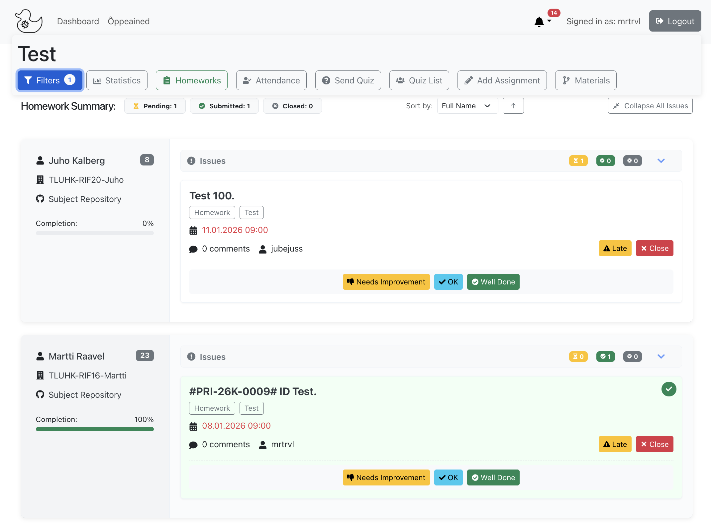

# Versioonihalduse integreerimine õppetöösse

Martti Raavel
TLÜ HK RIF õppekava juht
<martti.raavel@tlu.ee>

---

## Tallinna Ülikooli Haapsalu kolledž

- Haapsalus
- 4 rakenduskõrghariduse õppekava
- 1 magistriõppekava
- Umbes 270 üliõpilast

---

## Rakendusinformaatika õppekava

Veebiarendusele keskenduv rakenduskõrghariduse õppekava.

Ei ole ainult programmeerimine, vaid ka kõik muu, mis veebiarendusega kaasas käib, alates disainist ja kasutajakogemusest kuni valmis lahendusteni.

---

## Mis on versioonihaldus?

Versioonihaldus on tarkvarakoodi muudatuste jälgimise süsteem.

`Allikas: Atlassian`

---

## Miks versioonihaldus?

Tänapäeva tarkvaraarenduse oluline osa.

- Koodi ajalugu
- Koodi muudatuste jälgimine
- Koodi muudatuste tagasivõtmine
- Koodi muudatuste võrdlemine
- jne

> Ei pea olema ainult koodi jaoks!

`Pildi allikas: Double Momentum`

---

## Versioonihalduskeskkonnad

Keskkonnad, mis pakuavad git-i põhist versioonihaldusteenust:

- GitHub
- GitLab
- Bitbucket
- ...

---

## Miks me valisime GitHub-i?

- Ei soovinud ise majutada
- Laialt levinud
- Kasutajale tasuta
- Gihtub Campus programm
- Integratsioonide võimalused

---

## Versioonihaldus RIF õppekavas

Alustasime süstemaatilisemat versioonihalduse kasutuselevõttu alates 2021. aastast.

Selle aja jooksul proovinud erinevaid lähenemisi ja tööriistu.

---

## Probleemid kasutuselevõtuga

- Alguses raske aru saada
  - Terminoloogia
  - Üldised põhimõtted
  - Konfliktid koodis
  - Käsurida
  - ...
- Õpetajate kaasamine

---

## Kuidas teha nii, et õppimine oleks sujuv?

- Kasutamine alates esimesest päevast
- Integreerimine erinevatesse õppeainetesse
- Graafiline kasutajaliides (`GitHub Desktop`)
- Järk-järgult keerulisemaks (kood, harud, tõmbetaotlused, käsurida, ...)
- ...

---

## Mille jaoks kasutame?

- LMS-i asemel (mingil määral)
- Õppematerjalide repositoorium
- Koduste ülesannete jagamine ja esitamine
- Portfoolio loomise võimalus
- Projektid/projektijuhtimine
- Dokumentatsioon
- Suhtlus (mingil tasemel)
- ...

---

## Versioonihalduse kasutamise plussid

- Kõik on ühes kohas
- Jälgitav ajalugu (läbipaistvus)
- Õpilastele kasulik oskus - "Päris asi ..."
- Laiad koostöö võimalused
- Mingil määral isedokumenteeriv
- ...

---

## Organisatsioonipõhine lähenemine

- **Kolledži organisatsioon**
  - Info- ja õppematerjalid, kooliülesed projektid
- **Õppekava organisatsioon**
  - Grupitööde repositooriumid ja projektid
- **Üliõpilase organisatsioon**
  - Individuaalsed ressursid: Õppeainete repositooriumid, Projektid, Portfoolio

> Õpilased saavad hiljem oma organisatsiooni kaasa võtta.

---

## GitHub-il põhinev ökosüsteem

- Tööriist õpetajale
- Keycloak (kasutajad ja grupid)
- Discord (meeldetuletused, teavitused, testid)
- ...

---

## Tööriist õpetajale (orkestreerimine)

- Lihtsam õpetajate kaasamine
- Koduste tööde haldamine
- Ühtlustatud protsess ja struktuur
- Erinevad lisad
  - Kohalolu märkimine
  - Küsitlused
  - ...

---

## Mis edasi?

- Mõtestatud ülevaade (mitte lihtsalt kirjutatud koodiread)
- Õpiväljundite integratsioon
- Õpimärkide integratsioon
- ...

Ja muidugi õpetajate kaasamine ...

---

## Küsimused

---

## Aitäh!

<martti.raavel@tlu.ee>
