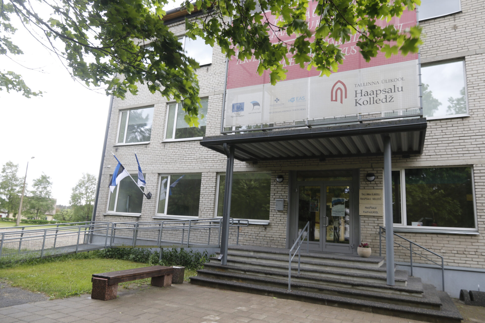
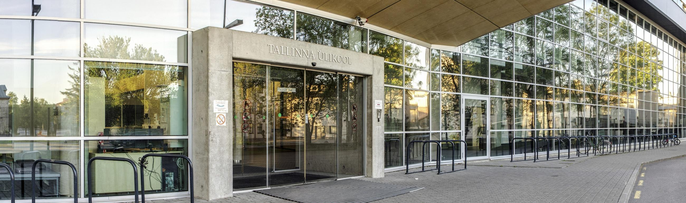
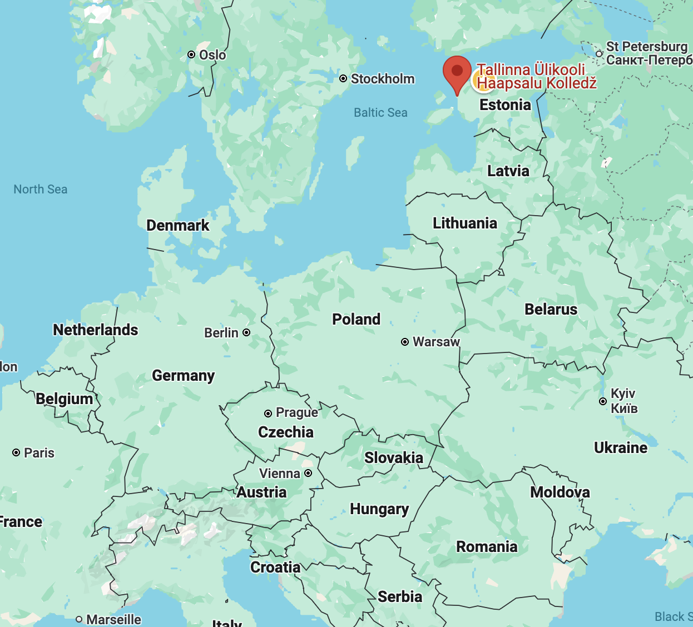
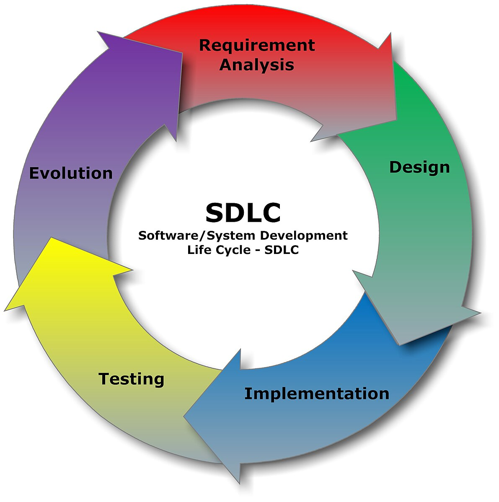

# Tallinn University Haapsalu College

Martti Raavel
<martti.raavel@tlu.ee>

---

## Tallinn University

- 3rd largest university in Estonia
- 7000 students
- 400 teachers/lecturers
- 6 institutes
- 1 college

---

## Haapsalu College

Regional College of Tallinn University

- Located in Haapsalu, Estonia
- Approximately 270 students
- Approximately 30 teachers

---

## Haapsalu College

- 4 applied higher education programmes
  - Applied Computer Science
  - Handicraft Technology and Design
  - Health Promotion Specialist
  - Traffic Safety
- 1 masters programme
  - Community work in ageing society

---

## Applied Informatics Curriculum

- Web development
  - Software development
  - Programming
  - Design
  - ...
    
