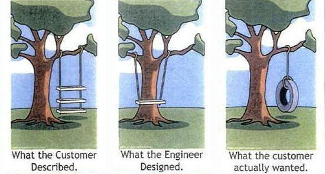
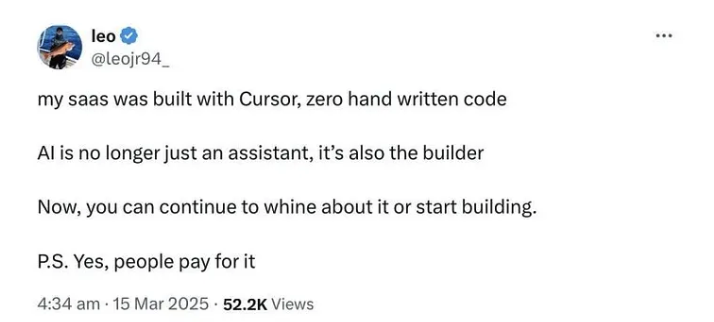
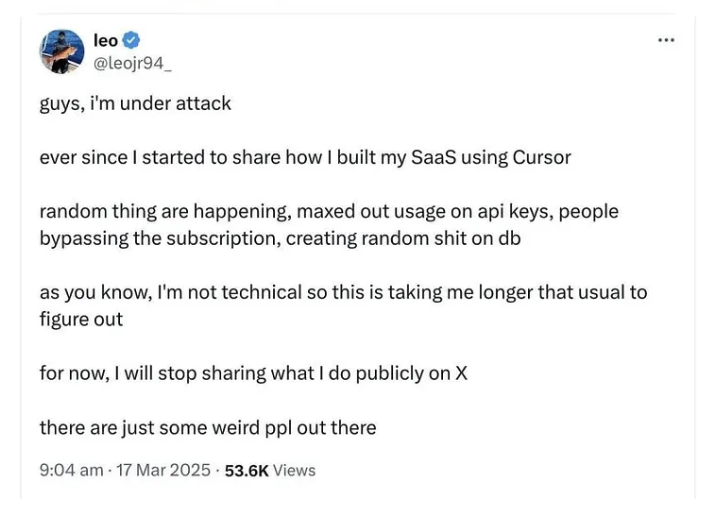

# Mida peab teadma vaibkoodimisest?

Martti Raavel
TLÜ HK RIF õppekava juht
<martti.raavel@tlu.ee>

---

## Rakendusinformaatika õppekava

- Tarkvaraarendus
- Programmeerimine
- Andmebaasid
- Disain
- ...

---

## Kes on kunagi mõelnud tarkvaraarendajaks hakkamise peale?

---

## Kes on kirjutanud TI-ga mõne programmi või rakenduse?

---

## Kuidas tarkvaraarendus käib?

---

## Tarkvaraarenduse elutsükkel

Tarkvaraarenduse elutsükkel (SDLC) on süsteemne protsess tarkvara planeerimiseks, loomiseks, testimiseks, juurutamiseks ja hooldamiseks. See määratleb etapid ja ülesanded, mis on seotud tarkvara tootmisega algusest kuni selle lõpetamiseni.

---

## Tarkvaraarenduse elutsükkel (SDLC)


---

## Tarkvaraarenduse meetodid

Tarkvaraarenduse meetodid on struktureeritud lähenemised tarkvaraarendusele, mis määratlevad etapid ja protsessid, mida tuleb järgida tarkvara tootmisel. Need meetodid võivad olla lineaarsed, järjestikused või iteratiivsed, sõltuvalt projekti olemusest ja nõuetest.

---

## Kose meetod

Lineaarne ja järjestikune lähenemine, kus iga faas tuleb lõpetada enne järgmise algust. See on varaseim SDLC lähenemine.


---

## Mis võiks olla probleem kose meetodi puhul?

---

## Probleemid

- Tarkvara arendamine võtab aega, vahel päris kaua
- Nõuded võivad muutuda arendamise ajal
- Protsess toimub ülevalt alla, eelmise sammu juurde tagasi ei minda
- Kliendi tagasiside saabub alles lõpus, kui tarkvara on valmis
- Kui lõpus midagi ei sobi, siis selle parandamine on kallis ja aeganõudev
- ...

---

## Kose meetod - maja ehitamine

Klient kirjeldab, millist maja ta soovib, arhitekt koostab plaani, ehitajad ehitavad maja, klient saab valmis maja ...

Poole pealt ei saa enam midagi muuta ja kui valmis maja juures midagi ei sobi, siis selle ümbertegemine on kallis ja aeganõudev.

---

## Agiilne meetod

Paindlik, tsükliline lähenemine tarkvara arendamisele, ,ille käigus luuakse tarkvara järk-järgult, keskendudes kliendi tagasisidele ja kiiretele iteratsioonidele.


---

## Agiilse meetodi probleemid

- Ei tea, kui kaua arendamine aega võtab, kuna nõuded võivad pidevalt muutuda
- Seetõttu ei tea ka seda, kui palju see lõpuks maksma läheb
- ...

---

## Agiilne meetod - maja ehitamine

Klient kirjeldab, millist maja ta soovib, arhitekt koostab plaani, ehitajad hakkavad maja ehitama, klient on kogu aeg protsessis kaasatud, saab anda tagasisidet ja teha muudatusi, kuni maja on valmis.

---

## Ükskõik, millise meetodi me valime, arusaamine kliendi nõuetest on kriitiline!!!

Enne, kui me saame hakata päriselt tarkvara looma, on meil vaja selget arusaamist sellest, mida klient soovib.

---



---

## Erinevad viisid, kudias lähenetakse arenduse osale selles tsüklis

- ...
- Kõigepealt kood ja siis testid
- Testipõhine arendus (TDD)
- Vaibkoodimine
- Nõuetepõhine arendus
- ...

---

## Kõigepealt kood ja siis testid

Arendaja hakkab vastavalt nõuetele koodi kirjutama. Kui kood on valmis, siis testib ja kirjutab dokumentatsiooni.

---

## Testipõhine arendus

Testipõhine arendus (TDD) on tarkvaraarenduse meetod, kus arendaja kirjutab esmalt testid, mis kirjeldavad soovitud funktsionaalsust, ja seejärel kirjutab koodi, mis need testid läbib. See protsess aitab tagada, et kood vastab nõuetele ja on hästi testitud.

---

## Testipõhine arendus


---

## Testide näited

```js
describe("sum", () => {
  it("should return the sum of two numbers", () => {
    expect(sum(2, 3)).toBe(5);
  });
});
describe("subtract", () => {
  it("should return the difference of two numbers", () => {
    expect(subtract(5, 2)).toBe(3);
  });
});
```

---

## Vaibkoodimine


[Allikas](https://programmerhumor.io/ai-memes)

---

## Mis on vaibkoodimine?

Vaibkoodimine on tarkvaraarenduse lähenemine, kus arendaja kasutab TI-d, et kiiresti genereerida koodi, prototüüpe või muudatusi, tuginedes loomulikus keeles esitatud ideedele ja nõuetele.

---

## Vaibkoodimine


---

## Vaibkoodimise viiba näide

`Loo React + TypeScript kalkulaatori rakendus, kus on liitmine/lahutamine/korrutamine/jagamine. Kalkulaator peab toime tulema vigase sisendiga.`

---

## Vaibkoodimine praktikas

- Hea: ideede katsetamine, demo, õppimine
- Halb: TI võib luua koodi, mis ei vasta nõuetele, on ebaühtlane, turvavigadega, raskesti hooldatav jne
- Miinimumnõue: testid, koodi ülevaatus ja turvalisuse kontroll

---

## Nõuetepõhine arendus

Vaibkoodimise struktureeritum ja kontrollitum lähenemine.

Nõuetepõhine arendus tähendab siin tööviisi, kus kõigepealt koostatakse TI abil nõuete dokumentatsioon ja alles seejärel hakatakse rakendust arendama.

---

## Nõuetepõhine arendus


---

## Nõuetepõhise arenduse näide

1. Esmane viip: "Koosta kalkulaatori rakenduse nõuded"
2. TI loob versiooni v0.1: liitmine, lahutamine, korrutamine, jagamine
3. Inimene täpsustab: vigase sisendi käsitlemine, nulliga jagamine, klaviatuuritugi
4. TI uuendab dokumendi v0.2 ja lisab testitavad vastuvõtukriteeriumid
5. Järgmine viip: disaini ja arhitektuuri ettepanek
6. TI loob v0.3: React + TypeScript, komponentide struktuur, andmevoog
7. Kordame tsüklit kuni nõuded on üheselt mõistetavad
8. Alles siis: arhitektuur, kood, testid

---

## Nõuete koostamine on iteratiivne

- Nõudeid ei kirjutata korraga "valmis"
- Iga iteratsioon vähendab arusaamatusi ja ümbertegemist
- TI kiirendab variatsioonide loomist
- Inimene kinnitab prioriteedid ja kvaliteedikriteeriumid

---

## Nõuetepõhine lähenemine vs vaibkoodimine

Nõuetepõhise lähenemise puhul toetub TI kogu aeg konkreetsetele juhistele ja nõuetele, mis on eelnevalt kokku lepitud. Seetõttu on väiksem tõenäosus, et TI loob midagi, mis ei ole kooskõlas projekti eesmärkidega või kvaliteedistandarditega.

---

## Võrdlus


---

## Mida kaasa võtta?

- Vaibkoodimine on kiire, kuid vajab tugevat kontrolli
- Nõuete loomine enne koodi vähendab riske ja aitab paranda kvaliteeti (ühtlus, nõuetest kinnipidamine, turvalisus jne)
- Parim tulemus tuleb iteratiivsest nõuete täpsustamisest

---


[Allikas](https://programmerhumor.io/security-memes/vibe-coding-your-mfa-wmd2)

---



[Allikas](https://medium.com/data-science-in-your-pocket/dont-be-a-vibe-coder-30fa7c525971)

---



---


[Allikas](https://programmerhumor.io/ai-memes)
