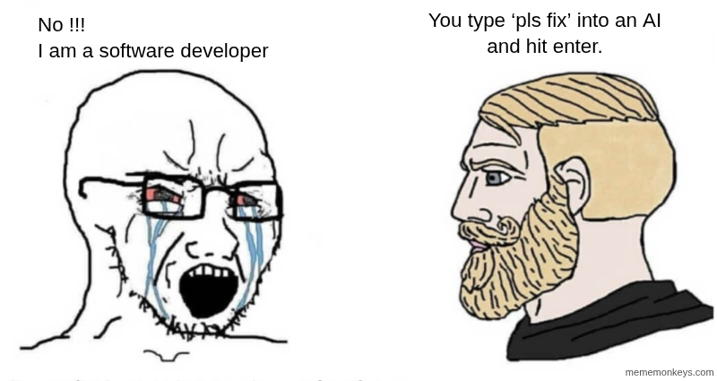
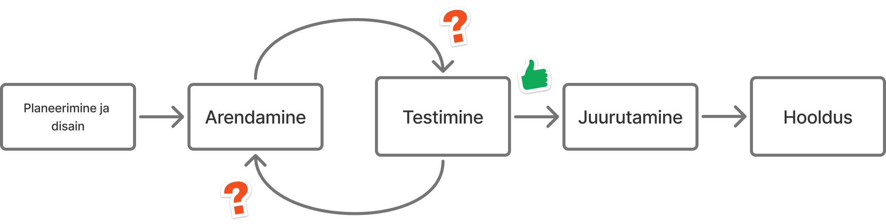
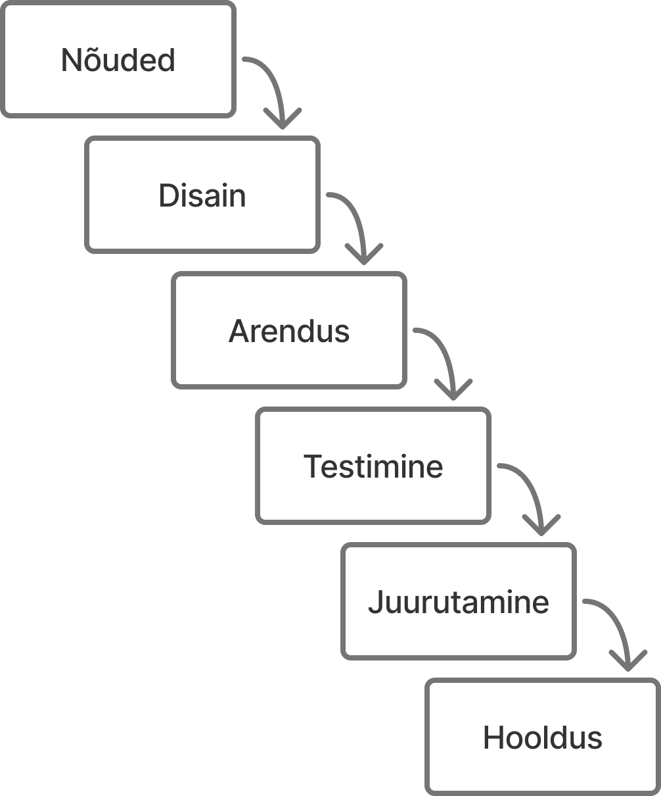
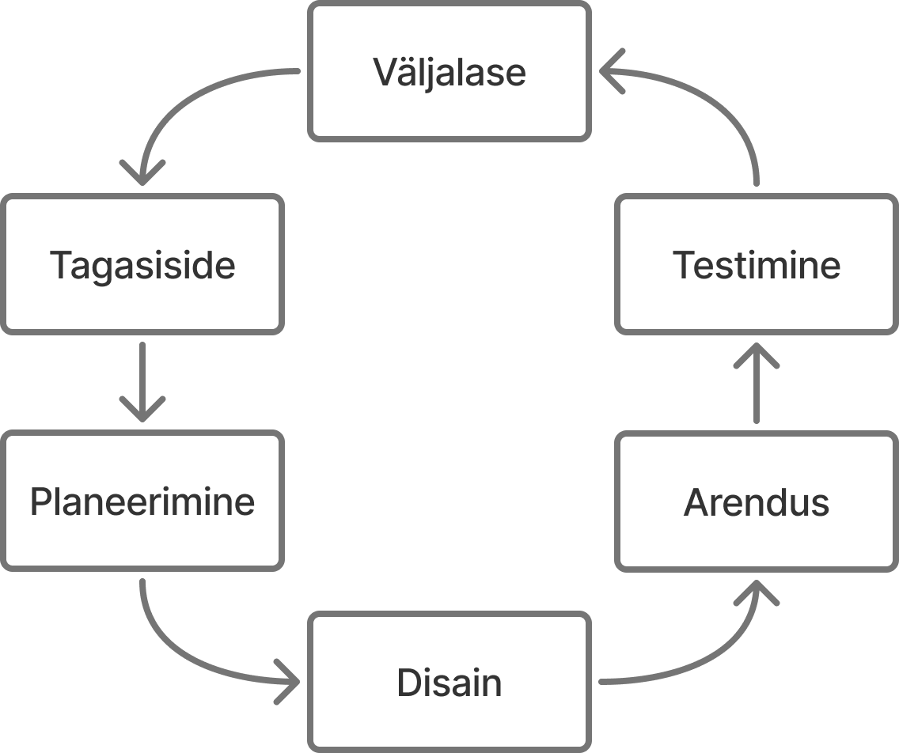
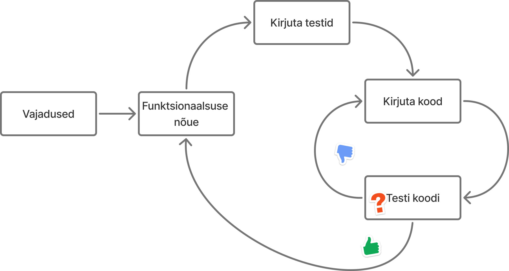
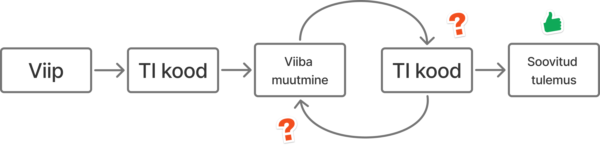
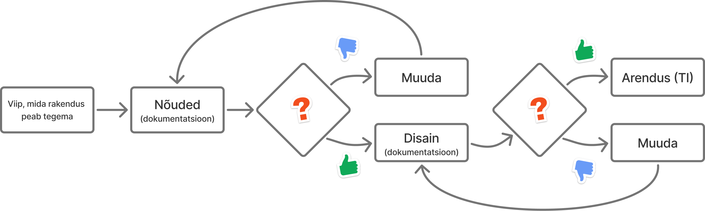
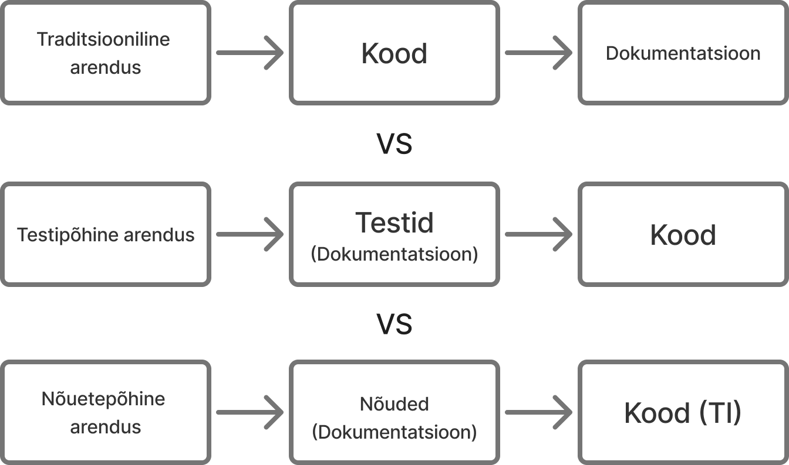
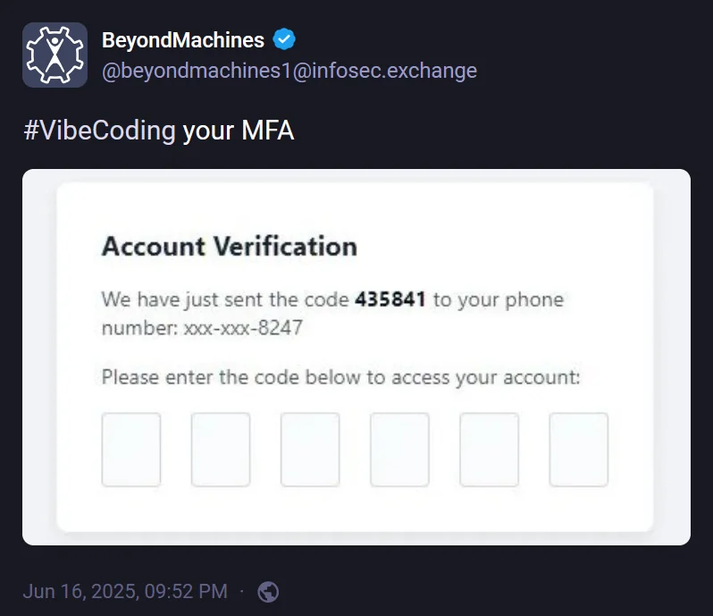

# Mida peab teadma vaibkoodimisest?

Martti Raavel
TLÜ HK RIF õppekava juht
<martti.raavel@tlu.ee>

---

## Kes on kunagi mõelnud tarkvaraarendajaks hakkamise peale?

---

## Kes on kirjutanud TI-ga mõne programmi või rakenduse?

---

## Kuidas tarkvaraarendus käib?

---



[Allikas](https://programmerhumor.io/ai-memes)

---

## Tarkvaraarenduse elutsükkel

Tarkvaraarenduse elutsükkel (SDLC) on süsteemne protsess tarkvara planeerimiseks, loomiseks, testimiseks, juurutamiseks ja hooldamiseks. See määratleb etapid ja ülesanded, mis on seotud tarkvara tootmisega algusest kuni selle lõpetamiseni.

---

## Tarkvaraarenduse elutsükkel



---

## Tarkvaraarenduse meetodid

Tarkvaraarenduse meetodid on struktureeritud lähenemised tarkvaraarendusele, mis määratlevad etapid ja protsessid, mida tuleb järgida tarkvara tootmisel. Need meetodid võivad olla lineaarsed, järjestikused või iteratiivsed, sõltuvalt projekti olemusest ja nõuetest.

---

## Kose meetod

Lineaarne ja järjestikune lähenemine, kus iga faas tuleb lõpetada enne järgmise algust. See on varaseim SDLC lähenemine.



---

## Agiilne meetod

Iteratiivne lähenemine tarkvara tarnimisele, mis ehitab tarkvara järk-järgult, keskendudes kliendi tagasisidele ja kiiretele iteratsioonidele.



---

## Erinevad lähenemised, kuidas koodi kirjutatakse

- Koodin kohe ja täpsustan jooksvalt
- Testipõhine arendus (TDD)
- Vaibkoodimine
- Nõuetepõhine arendus

---

## Testipõhine arendus

Testipõhine arendus (TDD) on tarkvaraarenduse meetod, kus arendaja kirjutab esmalt testid, mis kirjeldavad soovitud funktsionaalsust, ja seejärel kirjutab koodi, mis need testid läbib. See protsess aitab tagada, et kood vastab nõuetele ja on hästi testitud.

---

## Testipõhine arendus



---

## Testide näited

```js
describe("sum", () => {
  it("should return the sum of two numbers", () => {
    expect(sum(2, 3)).toBe(5);
  });
});
describe("subtract", () => {
  it("should return the difference of two numbers", () => {
    expect(subtract(5, 2)).toBe(3);
  });
});
```

---

## Mis on vaibkoodimine?

- Arendaja kirjeldab ideed loomulikus keeles
- TI genereerib kiiresti koodi, prototüübi või muudatused
- Tugevus: väga kiire algus ja eksperimenteerimine
- Risk: kvaliteet, turvalisus ja nõuete katvus võivad jääda nõrgaks

---

## Vaibkoodimine



---

## Vaibkoodimise viiba näide

`Loo React + TypeScript kalkulaatori rakendus, kus on liitmine/lahutamine/korrutamine/jagamine, vigase sisendi käsitlemine, ühikutestid Vitestiga ja lühike README.`

---

## Vaibkoodimine praktikas

- Hea: ideede katsetamine, demo, õppimine
- Halb: kriitilised süsteemid ilma kontrollita
- Miinimumnõue: testid, koodi ülevaatus ja turvalisuse kontroll

---

## Nõuetepõhine arendus

Nõuetepõhine arendus tähendab siin tööviisi, kus kõigepealt koostatakse TI abil nõuete dokumentatsioon ja alles seejärel hakatakse rakendust arendama.



---

## Nõuetepõhise arenduse näide

1. Esmane viip: "Koosta kalkulaatori rakenduse nõuded"
2. TI loob versiooni v0.1: liitmine, lahutamine, korrutamine, jagamine
3. Inimene täpsustab: vigase sisendi käsitlemine, nulliga jagamine, klaviatuuritugi
4. TI uuendab dokumendi v0.2 ja lisab testitavad vastuvõtukriteeriumid
5. Kordame tsüklit kuni nõuded on üheselt mõistetavad
6. Alles siis: arhitektuur, kood, testid

---

## Nõuete koostamine on iteratiivne

- Nõudeid ei kirjutata korraga "valmis"
- Iga iteratsioon vähendab arusaamatusi ja ümbertegemist
- TI kiirendab variatsioonide loomist
- Inimene kinnitab prioriteedid ja kvaliteedikriteeriumid

---

## Võrdlus



---

## Mida kaasa võtta?

- Vaibkoodimine on kiire, kuid vajab tugevat kontrolli
- Nõuete loomine enne koodi vähendab riske ja aitab paranda kvaliteeti (ühtlus, nõuetest kinnipidamine, turvalisus jne)
- Parim tulemus tuleb iteratiivsest nõuete täpsustamisest

---



[Allikas](https://programmerhumor.io/security-memes/vibe-coding-your-mfa-wmd2)

---


[Allikas](https://medium.com/data-science-in-your-pocket/dont-be-a-vibe-coder-30fa7c525971)

---


---


[Allikas](https://programmerhumor.io/ai-memes)
